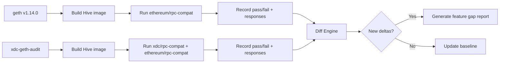

# Geth ↔ XDC-Geth Continuous Comparison Framework

## 1. Vision

Establish an automated, continuously running test pipeline that detects **what is new in upstream go-ethereum** (geth) and **what needs to be ported or adapted** in `xdc-geth-audit` (the XDC fork). The framework compares RPC behaviour, consensus parameters, and API surface across every geth release, surfacing deltas through a modern web dashboard.

---

## 2. Current State

### 2.1 What Exists

| Component | Details |
|-----------|---------|
| Hive framework | `C:\BlocksScan\hive` — Docker-based test harness for Ethereum clients |
| `xdc-geth-audit` client | `clients/xdc-geth-audit/` — builds XDC geth fork from local source |
| `xdpos` client | `clients/xdpos/` — baseline XDC Core Node (160/160 passing) |
| `go-ethereum` client | `clients/go-ethereum/` — upstream geth |
| `xdc/rpc-compat` simulator | `simulators/xdc/rpc-compat/` — 160 tests for XDC-specific RPC |
| `ethereum/rpc-compat` simulator | `simulators/ethereum/rpc-compat/` — dynamic tests from upstream `execution-apis` |
| Error ledger | `error_ledger/` — per-image dated JSON failure records |

### 2.2 Known Gaps

- No automated cross-client comparison (each client runs independently)
- No feature gap detection (what methods exist in geth but not in xdc-geth)
- No historical tracking of pass/fail trends
- No web UI — only terminal logs and markdown reports
- No CI/CD integration

---

## 3. Comparison Strategy

### 3.1 Two-Pronged Approach

```
                    ┌─────────────────────┐
                    │   Upstream geth      │
                    │   release vX.Y.Z     │
                    └──────────┬──────────┘
                               │
                 ┌─────────────┴─────────────┐
                 ▼                           ▼
        ┌────────────────┐         ┌────────────────┐
        │ ethereum/      │         │ xdc/           │
        │ rpc-compat     │         │ rpc-compat     │
        │ (227+ tests)   │         │ (160 tests)    │
        └───────┬────────┘         └───────┬────────┘
                │                          │
        ┌───────┴────────┐         ┌───────┴────────┐
        │ Compare pass/  │         │ Compare pass/  │
        │ fail + response│         │ fail + response│
        │ diffs between  │         │ diffs between  │
        │ geth & xdc     │         │ geth & xdc     │
        └───────┬────────┘         └───────┬────────┘
                │                          │
                └──────────┬───────────────┘
                           ▼
                ┌─────────────────────┐
                │   Delta Report      │
                │ - New methods       │
                │ - Changed responses │
                │ - New errors        │
                │ - Removed methods   │
                └─────────────────────┘
```

**Simulator A — `ethereum/rpc-compat`:**
- Purpose: Test standard Ethereum RPC compliance
- Fixtures: Cloned from `github.com/ethereum/execution-apis` at build time
- Supports `speconly` mode (OpenRPC schema validation) for response-shape tolerance
- Run against: `go-ethereum` (reference), `xdc-geth-audit` (target)
- Track: which tests pass/fail on each, response diffs per endpoint

**Simulator B — `xdc/rpc-compat`:**
- Purpose: Test XDC-specific RPC endpoints and XDPoS consensus
- Fixtures: 160 hand-crafted `.io` files in `simulators/xdc/rpc-compat/tests/`
- Run against: `xdc-geth-audit` (target), `xdpos` (baseline)
- Track: regression count vs baseline, response diffs

### 3.2 Release Tracking



**Process per geth release:**

1. Tag the geth version in `clients/go-ethereum/Dockerfile` or pin the commit
2. Build both client images: `go-ethereum` (new release) and `xdc-geth-audit`
3. Run both simulators against both clients (4 runs total)
4. Compare results:
   - Tests that pass on geth but fail on xdc-geth-audit → **priority porting candidates**
   - Tests where response shapes differ → **adaptation needed**
   - New methods in geth's `rpc_modules` not in xdc-geth's → **feature gaps**
   - Methods removed or deprecated in geth → **cleanup opportunities**

### 3.3 Feature Gap Detection

**Method-level comparison:**

```powershell
# Get supported methods from each client
curl -X POST -H "Content-Type: application/json" \
  -d '{"jsonrpc":"2.0","id":1,"method":"rpc_modules","params":[]}' \
  http://<client>:8545
```

Cross-reference against:
- Upstream `execution-apis` OpenRPC spec (all known Ethereum methods)
- geth release notes (`CHANGELOG.md`)
- EIP implementations per geth version

**Automated probe** — a small simulator that enumerates every known method from the OpenRPC spec and reports which return `-32601` (method not found) vs a valid response.

### 3.4 Response Diffing Pipeline

```json
{
  "comparison_id": "geth-v1.14.0-vs-xdc-audit-20260730",
  "client_a": "go-ethereum:v1.14.0",
  "client_b": "xdc-geth-audit:latest",
  "simulator": "ethereum/rpc-compat",
  "tests": {
    "total": 227,
    "both_pass": 200,
    "a_only": 20,
    "b_only": 0,
    "both_fail_diff_response": 7
  },
  "response_diffs": [
    {
      "method": "eth_gasPrice",
      "client_a": "0x430e23400",
      "client_b": "0xf4240",
      "diff": "18 Gwei vs 1 Gwei"
    }
  ],
  "feature_gaps": {
    "methods_in_a_not_b": ["eth_blobBaseFee", "eth_createAccessList"],
    "modules_in_a_not_b": []
  }
}
```

---

## 4. Modern UI Dashboard

### 4.1 Architecture

```
┌─────────────────────────────────────────────────────────┐
│                    Web Dashboard (React/Vue)              │
├─────────────────────────────────────────────────────────┤
│  ┌─────────┐  ┌──────────┐  ┌──────────┐  ┌─────────┐  │
│  │ Run     │  │ Trend    │  │ Feature  │  │ Diff    │  │
│  │ Results │  │ Charts   │  │ Gap      │  │ Viewer  │  │
│  │ (table) │  │ (charts) │  │ Matrix   │  │ (split) │  │
│  └────┬────┘  └────┬─────┘  └────┬─────┘  └────┬────┘  │
│       └────────────┴─────────────┴──────────────┘       │
│                        │                                │
└────────────────────────┼────────────────────────────────┘
                         │
┌────────────────────────┼────────────────────────────────┐
│            API Layer (Go/Node.js backend)               │
│  ┌──────────┐  ┌───────────┐  ┌────────────────┐       │
│  │ Run Mgmt │  │ Results   │  │ Alert/Notify   │       │
│  │ (trigger │  │ Store     │  │ (Slack/Email)  │       │
│  │  + queue)│  │ (SQLite/  │  │                │       │
│  │          │  │  Postgres)│  │                │       │
│  └──────────┘  └───────────┘  └────────────────┘       │
└─────────────────────────────────────────────────────────┘
                         │
┌────────────────────────┼────────────────────────────────┐
│                   Hive Runner (CLI)                      │
│  hive --sim <suite> --client <client> --sim.limit ...   │
└─────────────────────────────────────────────────────────┘
```

### 4.2 Screens / Views

#### 4.2.1 Run Results Dashboard

Default landing page showing the latest comparison run.

| Run ID | Date | Clients | Simulator | Total | Pass | Fail | Δ vs Prev |
|--------|------|---------|-----------|-------|------|------|-----------|
| `#042` | 30 Jul | geth-v1.14.0 vs xdc-audit | ethereum/rpc-compat | 227 | 226 | 1 | 0 |
| `#041` | 29 Jul | geth-v1.13.0 vs xdc-audit | ethereum/rpc-compat | 227 | 225 | 2 | +1 |
| `#040` | 28 Jul | xdc-audit vs xdpos | xdc/rpc-compat | 160 | 134 | 26 | — |

**Features:**
- Row expansion to show per-test pass/fail/details
- Color-coded: green (pass), red (fail), amber (response diff but both pass)
- Filter by client version, simulator, date range
- Export to CSV/JSON

#### 4.2.2 Trend Charts

Time-series visualizations:

- **Pass rate over time** per client-simulator pair (line chart)
- **Regression count** per geth release (bar chart)
- **Test stability** — tests that flake (pass/fail oscillate) flagged
- **Coverage growth** — number of XDC-specific tests over time

#### 4.2.3 Feature Gap Matrix

A heatmap or table comparing method-level support:

```
┌─────────────────────┬──────────┬──────────┬──────────┐
│ Method              │ geth     │ xdc-audit│ xdpos    │
├─────────────────────┼──────────┼──────────┼──────────┤
│ eth_blockNumber     │ ✅       │ ✅       │ ✅       │
│ eth_blobBaseFee     │ ✅       │ ❌       │ ❌       │
│ eth_createAccessList│ ✅       │ ❌       │ ❌       │
│ eth_getWork         │ ❌       │ ✅       │ ✅       │
│ XDPoS_getSnapshot   │ ❌       │ ✅       │ ✅       │
└─────────────────────┴──────────┴──────────┴──────────┘
```

**Features:**
- Sort by gap status (missing in xdc-audit)
- Link to upstream EIP/geth PR for each method
- Click to view method signature and params
- Auto-generated from `rpc_modules` + method probing

#### 4.2.4 Side-by-Side Diff Viewer

For each failing test, show a split-pane diff:

```
┌────────────────────────┬────────────────────────┐
│  go-ethereum v1.14.0  │  xdc-geth-audit        │
├────────────────────────┼────────────────────────┤
│ {                      │ {                      │
│   "jsonrpc": "2.0",   │   "jsonrpc": "2.0",   │
│   "id": 1,            │   "id": 1,            │
│   "result": {         │   "result": {         │
│     "miner":          │     "miner":          │
│      "0x0000...",     │     "xdc0000...",     │ ← diff
│     "gasLimit":       │     "gasLimit":       │
│      "0x47b760",      │      "0x47b760",      │
│     "totalDifficulty":│     "totalDifficulty":│
│      "0x1"            │     "0x0"             │ ← diff
│   }                   │   }                   │
│ }                     │ }                     │
└────────────────────────┴────────────────────────┘
```

**Features:**
- Syntax-highlighted JSON
- Line-level diff markers
- Ability to mark as "expected difference" (suppress future alerts)
- Copy response as fixture template

#### 4.2.5 Alert / Notification Center

- **New regression alerts:** Test that was passing now fails
- **New feature alerts:** Method appeared in geth that doesn't exist in xdc-audit
- **Baseline change alerts:** xdpos baseline updated (fixture changes)
- Delivery: Slack webhook, email, in-app notification

### 4.3 Technology Choices (Proposed)

| Layer | Option | Rationale |
|-------|--------|-----------|
| Frontend | React + TypeScript + Recharts/Victory | Rich charting, ecosystem |
| Backend | Go (std lib http) or Node.js/Express | Go aligns with Hive codebase |
| Database | SQLite (dev), Postgres (prod) | Simple schema, easy migration |
| CI Integration | GitHub Actions + Docker Compose | Runs in CI or locally |
| Hosting | Docker Compose stack | Same as Hive deployment model |

---

## 5. Implementation Roadmap

### Phase 1: Foundation (2-3 weeks)

| Task | Description |
|------|-------------|
| P1.1 | Script that runs both simulators against both clients and collects structured JSON results |
| P1.2 | Cross-client result merger — align test names, diff pass/fail status |
| P1.3 | `rpc_modules` probe simulator — enumerate all supported methods from both clients |
| P1.4 | Feature gap matrix generator (compare method lists against OpenRPC spec) |
| P1.5 | Store results in `error_ledger/` with version tags |
| Deliverable | CLI tool (`compare.ps1`) that produces a structured comparison report |

### Phase 2: Web Backend + Database (2-3 weeks)

| Task | Description |
|------|-------------|
| P2.1 | Design schema (runs, tests, clients, versions, results, diffs, alerts) |
| P2.2 | Build REST API: submit results, query history, trigger runs |
| P2.3 | Persistent storage with migration support |
| P2.4 | Webhook receiver for CI pipeline results |
| Deliverable | Running API server with historical data from Phase 1 imports |

### Phase 3: Dashboard UI (3-4 weeks)

| Task | Description |
|------|-------------|
| P3.1 | Run results table with filtering, sorting, expansion |
| P3.2 | Trend charts (pass rate, regression count over time) |
| P3.3 | Feature gap matrix with heatmap |
| P3.4 | Side-by-side JSON diff viewer |
| P3.5 | Notification center (Slack integration) |
| Deliverable | Fully functional web dashboard |

### Phase 4: Automation + CI (2 weeks)

| Task | Description |
|------|-------------|
| P4.1 | GitHub Actions workflow triggered on geth tag/release |
| P4.2 | Scheduled weekly runs (e.g., every Monday) |
| P4.3 | Automatic PR creation when feature gaps are detected |
| P4.4 | Dashboard deployed as Docker Compose stack |
| Deliverable | Fully automated pipeline with zero manual steps |

---

## 6. Key Metrics to Track

| Metric | Why |
|--------|-----|
| **Pass rate delta** (geth - xdc-audit) | Measures RPC compliance gap |
| **Regression count per geth release** | Impact of upstream changes on XDC fork |
| **Feature gap count** | Number of methods missing in xdc-audit |
| **Fixture coverage** % | What % of upstream test fixtures are covered by xdc/rpc-compat |
| **Mean time to detect** | How quickly after a geth release are gaps identified |
| **Lead time to fix** | Time from gap detection to port/adaptation |

---

## 7. Success Criteria

1. Any new geth release automatically triggers a comparison run
2. New RPC methods in geth are flagged within 24 hours of release
3. Response shape changes are shown with precise JSON diffs
4. Dashboard requires zero CLI interaction for stakeholders
5. Regression alerts reach the team before end-users report issues
